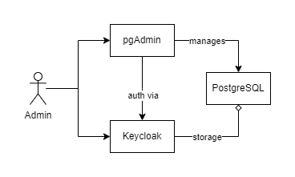

# Avalanche CMS Local Stack Deployment

## Overview

Quick start guide to set up Avalanche CMS with PostgreSQL, pgAdmin, and Keycloak.

## Prerequisites

Designed for Windows 11, compatible with Linux (adjustments needed, see below). Install:

- **Docker Desktop**: [Download](https://www.docker.com/products/docker-desktop)
- **Python 3**: [Download](https://www.python.org/downloads/)
- **Git Bash** (Windows/Mac): [Download](https://gitforwindows.org/) (Linux: use `/bin/sh`)

**Linux Note**: Add `127.0.0.1 host.docker.internal` to `/etc/hosts` to mimic Docker Desktop's handling of `host.docker.internal`, allowing containers to access the host machine's network services:

```bash
echo "127.0.0.1 host.docker.internal" | sudo tee -a /etc/hosts
```

## Components

Avalanche CMS local stack utilizes Docker Compose and comprises:

- **PostgreSQL (v16)**: Port 5432
- **pgAdmin (v4)**: http://host.docker.internal:5050/ (Keycloak auth)
- **Keycloak (v23)**: http://host.docker.internal:8080/

## Setup

Navigate to `scripts/local/` for all operations with `cd scripts/local/`.

### 1. Secrets

Generate secrets:

```bash
python setup.py -a
```

*Interactive mode without `-a`.*

### 2. Launch

Start the stack:

```bash
python start.py
```

*Use `-d` for detached mode.*

### 3. Access

Service access and passwords:

| Service           | URL                               | Username           | Password Location                           |
|-------------------|-----------------------------------|--------------------|---------------------------------------------|
| **pgAdmin**       | http://host.docker.internal:5050/ | `adminuser`        | `.secrets/avalanchecms-adminuser-secret.env`|
| **Keycloak Admin UI** | http://host.docker.internal:8080/ | `keycloakadminuser` | `.secrets/keycloak-admin-user-secret.env`   |

## Detailed Description

### Architecture

The local stack, designed for Windows 11 with Docker Desktop, uses Docker Compose with three infrastructure components:

- **PostgreSQL**: Relational database for Avalanche CMS and Keycloak. Uses a Docker volume for storage.
- **pgAdmin**: Web tool for PostgreSQL management, authenticated by Keycloak. Uses PostgreSQL for storage.
- **Keycloak**: Manages user identities and authorization. Uses PostgreSQL as storage.


